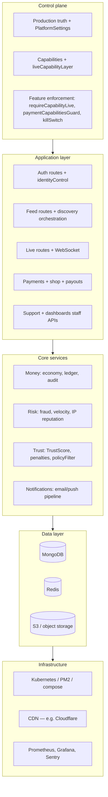

# Final architecture — Millo platform

**Production:** https://milloapp.com

Five layers, top to bottom: **control plane** (truth and enforcement) → **application** (HTTP/WS product surfaces) → **core services** (domain engines) → **data** → **infrastructure** (runtime, edge, observability).

```
┌──────────────────────────────────────────────┐
│              CONTROL PLANE                   │
│ (Capabilities + Truth + Feature Enforcement) │
└──────────────────────────────────────────────┘
                    ↓
┌──────────────────────────────────────────────┐
│              APPLICATION LAYER               │
│ Auth | Feed | Live | Payments | Support      │
└──────────────────────────────────────────────┘
                    ↓
┌──────────────────────────────────────────────┐
│              CORE SERVICES                   │
│ Money | Risk | Trust | Notifications         │
└──────────────────────────────────────────────┘
                    ↓
┌──────────────────────────────────────────────┐
│              DATA LAYER                      │
│ MongoDB | Redis | S3                         │
└──────────────────────────────────────────────┘
                    ↓
┌──────────────────────────────────────────────┐
│              INFRASTRUCTURE                  │
│ Kubernetes | CDN | Observability             │
└──────────────────────────────────────────────┘
```



---

## 1. Control plane

| Concern | Role | Primary locations |
|--------|------|-------------------|
| **Truth** | LIVE / BETA / DISABLED (and env-backed reality) for payments, payouts, KYC, email, push, OAuth, etc. | `config/production-truth.js` → `packages/api/src/config/capabilities.js` (`getTrustSurface`, `getCapabilities`) |
| **Capabilities** | What the platform can do right now; live vs stubbed (e.g. streaming, filters) | `liveCapabilityLayer.js`, `capabilityRegistry.js` |
| **Feature enforcement** | Block or degrade when not LIVE; payment-surface guards | `core/control-plane/enforcement.js`, `middleware/paymentCapabilitiesGuard.js`, `packages/shared` killSwitch, `validateEnv` / `productionGuard` |
| **Introspection** | Ops and clients read effective posture | `GET /system/*`, `GET /api/live/status`, admin feature toggles |

**Rule:** Application routes must respect control plane mode (e.g. `503 SYSTEM_CAPABILITY_DISABLED` when a capability is not LIVE).

---

## 2. Application layer

Product-facing HTTP/WebSocket boundaries (Fastify `packages/api`).

| Surface | Scope | Anchors |
|---------|--------|---------|
| **Auth** | Sessions, JWT/Bearer, OAuth, provider registry vs capabilities | `routes/auth.js`, `services/identityControl.js`, `authProviderRegistry.js` |
| **Feed** | For You / explore / following; guarantee hydration + trending fallback | `routes/feed.js`, `feedItemHydration.service.js`, `@millo/discovery` |
| **Live** | Start/stop stream, ingest, auctions WS, mode-aware UX inputs | `routes/live.js`, `liveModeStatus.js` |
| **Payments** | Checkout, webhooks, wallets, shop checkout | `routes/payments.js`, `routes/shop.js`, `routes/payout.js` |
| **Support** | Tickets, staff dashboards entrypoints | `routes/support.js`, `routes/dashboards.js` (support sections) |

---

## 3. Core services

Reusable domain logic invoked by the application layer (and workers).

| Service | Scope | Anchors |
|---------|--------|---------|
| **Money** | Ledger append, wallet credit/debit, idempotency, financial audit | `packages/economy`, `LedgerEntry`, `FinancialAuditLog`, `PaymentTransaction` |
| **Risk** | Fraud checks, velocity, chargebacks, device risk | `fraudService`, `riskEngine`, `deviceRiskEnforcement`, etc. |
| **Trust** | Trust scores, penalties, discovery policy gates | `trustEnforcement`, `packages/discovery/policyFilter.js`, `TrustScore` |
| **Notifications** | Email/push orchestration, provider selection vs capabilities | `notificationService.js`, `notifyUser`, Kafka/queue where used |

---

## 4. Data layer

| Store | Use | Notes |
|-------|-----|--------|
| **MongoDB** | Primary document store — users, streams, commerce, support, audit | `@millo/database` schemas |
| **Redis** | Cache, rate limits, BullMQ, optional feed cache | `packages/api/src/lib/redis.js`, env `REDIS_URL` |
| **S3** | Media, uploads, CDN origin (config-dependent) | Env + `infra/s3-binding.sh` patterns |

---

## 5. Infrastructure

| Area | Role | Anchors |
|------|------|---------|
| **Kubernetes** | Scale-out API, workers, Janus, Kafka (reference manifests) | `infra/k8s/*` |
| **Runtime on VM** | PM2, Nginx, Ubuntu install | `ecosystem.config.js`, `scripts/install-ubuntu-22.04.sh`, `infra/nginx/` |
| **CDN** | TLS, caching, bot/WAF at edge | `infra/cloudflare/*`, production `https://milloapp.com` |
| **Observability** | Metrics, dashboards, errors | `GET /metrics`, `infra/monitoring/`, `GET /admin/metrics/*`, Sentry in `packages/api/src/index.js` |

---

## Related docs

- Infra/service map: [architecture-infrastructure-stack.md](./architecture-infrastructure-stack.md)
- Phase ordering: [phase-0-system-priming.md](./phase-0-system-priming.md)
