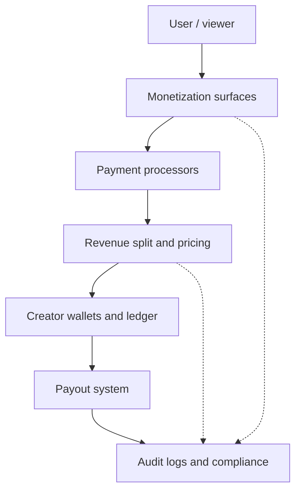

# Monetization architecture

How **viewer spend** flows through ads, gifts, subscriptions, and shop/PPV, into **Stripe (and related processors)**, **revenue splits**, **creator balances**, **payouts**, and **audit / compliance**.  
Production domain: `https://milloapp.com`

This is a **facade map** aligned to implemented packages; see `docs/phase-*.md` for phase ownership.

---

## End-to-end flow

**Narrative (same as diagram):**

1. **User (viewer)** — authenticates; spends via coins, card (Stripe Checkout), or in-app purchase flows as implemented per surface.
2. **Ad engine + gift purchases + subscriptions (+ shop, PPV, tickets, auctions)** — where money or coins are committed.
3. **Payment processor (Stripe)** — card charges, Checkout sessions, webhooks; **PayPal** and **Wise** appear in payout / webhook paths where wired (`packages/billing`, `packages/api/src/routes/payments.js`).
4. **Revenue split engine** — platform fee vs creator share (`@millo/economy` `pricing.splitRevenue`, `splitRevenueByCreator`, `recordRevenue` in `revenueSplits.js`).
5. **Creator wallets** — `Wallet` / `CreatorWallet` + `economy.credit` / `LedgerEntry` (`packages/economy/src/coins.js`, `creatorWallet.js`, `ledger.js`).
6. **Payout system** — `requestPayout` / `approvePayout` (`packages/billing/src/payouts.js`), `payout-retry` worker, providers: Stripe, PayPal, Wise, bank transfer (orchestration enums).
7. **Audit logs + compliance** — `FinancialAuditLog`, `AdminAuditLog`, `AuditLog` (ads attribution, admin overrides); Phase 9–11 patterns.

---

## Layer reference (code)

| Layer | Role | Primary locations |
|--------|------|-------------------|
| **Viewer** | Session, wallet balance, fraud gates | `packages/api/src/routes/auth.js`, `payments.js`, `fraud.service.js` |
| **Ad engine** | Auction, delivery, spend caps | `packages/ads/` — `docs/phase-8-ads-engine.md`; attribution → `AuditLog` |
| **Gifts** | Debit sender, credit creator share | `packages/api/src/routes/content.js` (`POST /content/gifts/send`), WS path in `live.js`; `@millo/economy` `gifts` / `coins` |
| **Subscriptions** | Recurring / coin-based sub flows | `packages/api/src/routes/payments.js`, `packages/database` `Subscription` |
| **Shop / PPV / tickets** | Order + unlock splits | `payments.js` `createOrderFromItems`, `content.js` PPV; `pricing.splitRevenue*` |
| **Payment processor** | Stripe (charges, Connect-style payouts) | `packages/billing/src/stripe.js`, `packages/api/src/services/payments/stripeService.js`, webhooks in `payments.js` |
| **Revenue split engine** | Fees and creator percentages | `packages/economy/src/pricing.js`, `revenueSplits.js`; `paymentOrchestration.processPayment` |
| **Creator wallets** | Balance + payout eligibility | `CreatorWallet`, `economy.credit`, `LedgerEntry`; `creatorWallet.js`, `coins.js` |
| **Payout system** | Request → approve → provider | `packages/billing/src/payouts.js`, `retryWorker.js`, `packages/workers/src/payout-retry-worker.js` |
| **Audit + compliance** | Every financial mutation logged | `FinancialAuditLog` (billing), `writeAuditLog` / `AuditLog`, ad attribution; `docs/phase-9-billing-payouts.md`, `docs/phase-10-shipping-compliance.md` |

---

## Money vs coins (mental model)

- **Coins** — Often internal `Wallet.balanceCents`; topped up via Stripe (and similar); spent on gifts, subs, PPV as implemented.
- **Creator earnings** — Credited via `economy.credit` into creator `Wallet` / `CreatorWallet` per rules (e.g. pending for unverified creators — `giftReceiverEligibility`).
- **Fiat payout** — Separated into **PayoutRequest** + provider transfer; not the same document as a single `LedgerEntry` line (see billing package).

---

## Kill-switches and safety (examples)

- **Ads:** `ADS_ENABLED=false` → no delivery (`packages/ads/src/config.js`).
- **Fraud / velocity** — Gift and subscription paths (`fraud.service.js`, cooldowns, CRS gates).
- **Idempotency** — Stripe/PayPal charge and payout (`packages/billing/src/idempotency.js`).

---

## Related documentation

| Doc | Topic |
|-----|--------|
| `docs/phase-8-ads-engine.md` | Ads auction, pacing, attribution |
| `docs/phase-9-billing-payouts.md` | Stripe, PayPal, payouts, webhooks, idempotency |
| `docs/phase-6-economy-commerce.md` | Economy / commerce scope |
| `docs/phase-11-fraud-prevention.md` | Fraud and payment abuse |
| `packages/economy/src/pricing.js` | Split helpers used by API routes |

---

*Architecture overview only; fees and percentages are configured in code/env — verify before production launch.*
